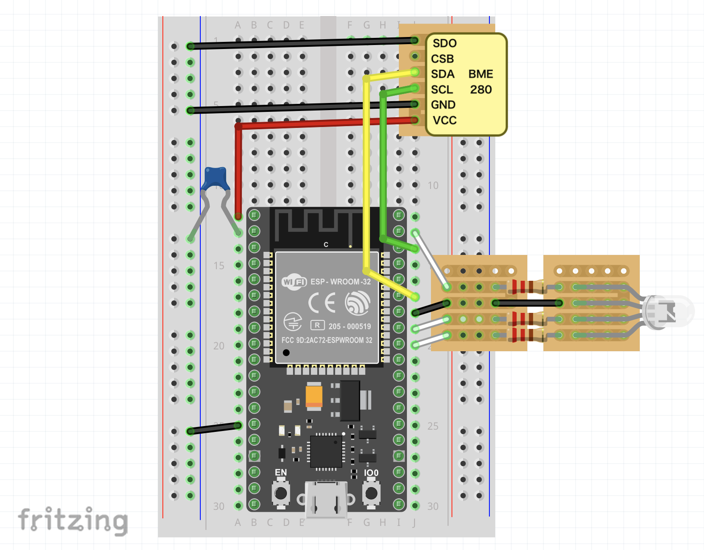

## 📁ファイル構成
- それぞれのフォルダには、各処理区のプログラムと配線図があります。
    - 1_タイマー区
    - 2_日射句
    - 3_通常区
    - 4_EC区
    - 温湿度気圧計
- 各処理区を作るための部品内訳と費用は、"Cost_of_each_area.pdf" に記載しています。

## 🧑‍💻プログラム
### 共通LED設定
| LED色 | 状態 |
| :---: | :---|
| 緑 | 正常に稼働中 |
| 青 | 潅水中 |
| 紫 | プログラムsetup中 |
| 水 | 閾値をサーバから受信できた(EC区のみ) |
| 赤 | センサの出力値が取得できない Ambientにpostできない

---

### 1_タイマー区
**概要**
- 潅水回数、潅水する時間を毎日人手で設定し、設定に基づき潅水する
- 1回の潅水で、ポンプを20分間作動させる

**farm_area1.py**
1. 日付が変わった瞬間にGoogle Calendarを読み込み、潅水予定をirrigation.txtに出力する（プログラムが途中で止まっても潅水状況を保存できるようにするため）
2. irrigation.txtには潅水したかどうかの0/1と日付・時間を出力し、潅水を記録する
3. 1分ごとループを回し、潅水時間になったらorもし今より前に潅水するはずなのに潅水されていなかったら、潅水する
4. 潅水時は、irrigation.txtに1を上書きする
5. Ambientにpostする

**Raspi内での設定**
- cronで実行

**配線図** 

---

### 2_日射区
**概要**
- 積算日射量を測定し、0.6MJを超えたとき3分間潅水する
- 潅水後に積算日射量の値を0にリセットする
- 潅水したくない夕方〜夜の時間帯は閾値を超えても潅水せず、日射量を蓄積する

**farm_area2.py**
1. 積算日射量をval_total.txtとして出力する（プログラムが途中で止まっても積算日射量を保持できるようにするため）
2. 1回のタームは60秒間で、ターム内の合計値はval_sum、全体の合計値はval_totalに格納する
3. 60秒間測定したら、ターム内の平均値をval_aveとして格納する
4. val_totalが閾値を超え、かつ現在時刻が潅水時間を満たしていたら潅水する
5. 潅水時はval_totalを0にする
6. val_total.txtを更新し、Ambientにpostする

**Raspi内での設定**
- cronで実行

**配線図** 

---

### 3_通常区
**概要**
- SEN0193をそれぞれ3つのメロンに用いて体積含水率の平均値を算出する
- 体積含水率が、33%を下回ったとき5分間潅水する
- 潅水後30分間は、潅水しない

**farm-area3.ino**
- SEN0193を測定し、それぞれanalogread()の値が1000を超えていたら正常に測定できたと判断して測定対象にし、平均値・体積含水率を算出する
- 体積含水率が閾値を下回っていて、かつ前回の潅水から30分以上経過していたら(irrigation_countdown==0)潅水する
- Ambientにpostする
- SENSING_INTERVALに定義した時間の分だけdelay()

**配線図** 

---

### 4_EC区
**概要**
- SEN0193, LM393をそれぞれ3つのメロンに用いて体積含水率の平均値を算出する
- 体積含水率が、33%を下回ったとき5分間潅水する
- 潅水後30分間は、潅水しない
- 閾値はGoogle Sheetsからユーザが変更できる（本実験中は33%のまま変更することはなかった）

**farm-area4.ino**
- LM393, SEN0193の順に測定、それぞれanalogread()の値が1000を超えていたら正常に測定できたと判断して測定対象にし、平均値・体積含水率を算出する
- Google Sheetsから閾値を取得する。このとき、まずタイマー区のRaspiが閾値を取得してサーバを立て、閾値を返せるように準備しており（farm_area4_server.py）、EC区のESP32からリクエストを送って取得する
- 体積含水率が閾値を下回っていて、かつ前回の潅水から30分以上経過していたら(irrigation_countdown==0)潅水する
- Ambientにpostする
- SENSING_INTERVALに定義した時間の分だけdelay()

**配線図** 

---

### 温湿度気圧計
**概要**
- 温度・湿度・気圧を毎分測定する

**thermometer.ino**
- 温度・湿度・気圧をI2C通信で測定する
- Ambientにpostする
- SENSING_INTERVALに定義した時間の分だけdelay()

**配線図** 
